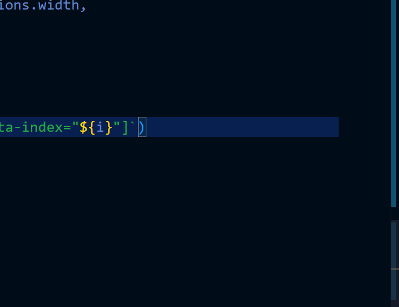
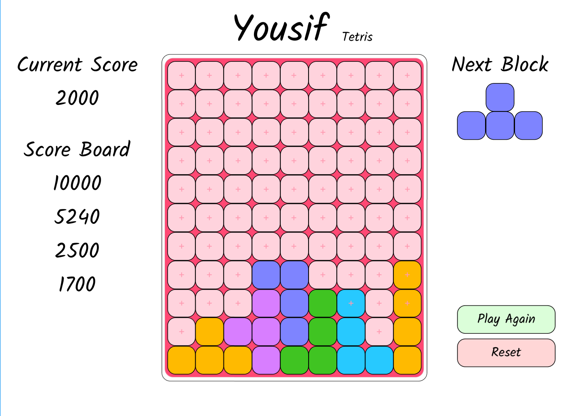

# Tetris Unit 1 Project

## Date: 29/6/2025

### By: Yousif Radhi

### Project Description
This is the unit 1 project, and it is intended to be a simple Tetris version programmed using HTML, CSS, and vanilla JavaScript.
### Getting Started
The game is already online! Click here to [visit](surge link) it.

### Future Updates
- bla bla bla
- bla bla bla

### Wireframes

### Psudo Code 

#### HTML

- An element with grid display to represent the board.

#### Script.js

##### Variables

- Board state: 2D array to show the current board state

- Board element: the actual HTML board container node

- Current block position: will store the current falling Tetris block position

- Level

- Falling speed: fixed number * the current level

- Blocks: array of the blocks shape

##### Functions

- Create block: Will pick a random block from the blocks array, then attach it to the board by changing the color of the grid cells. This function will update the current block and the current block position variables.

- Increase score: Will increase the score according to the filled rows before removing them

- Filled rows check: A continuous loop to check if one of the rows is already filled; if so, the whole row will be deleted and all of the filled rows above it will be shifted.

- Game over check: checks if one of the blocks is outside the board; if so, the game will end.

##### Intervals

- An interval moves the current block downward as long as the bottom is not touching another block; this will be done by increasing the row that the block is already in in each iteration.

##### event listeners

- Arrows event listeners: will move the current block by 1 each time or as long as the left/right arrow is pressed
# Tetris---GA-P1
